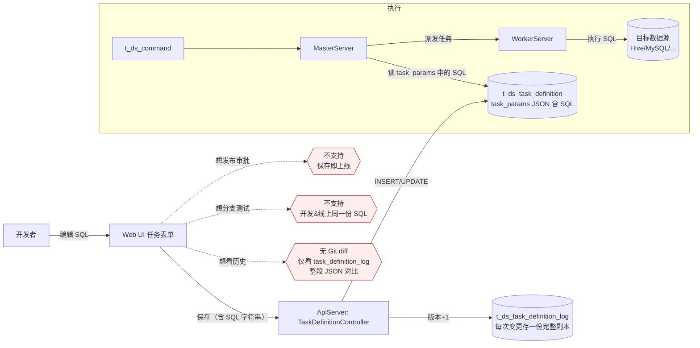
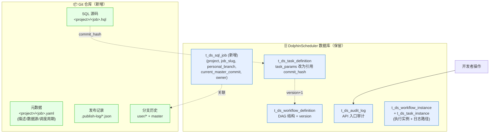
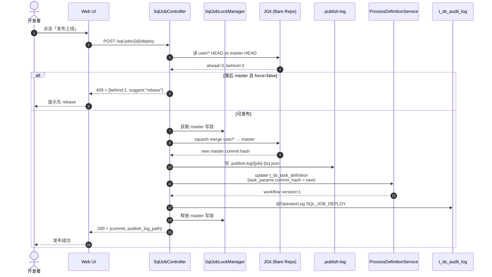

# 技术设计：SQL 内容 Git 管理

> 本文档解决 PRD review 时指出的关键设计缺口：JGit 选型、并发模型、与 DS 现有体系的关系、回滚机制、AI 集成边界。

## 0. 流程图：现有 SQL 管理 vs 新 Git 管理

### 0.1 现有 DolphinScheduler 的 SQL 存储与执行链路

> 现状：SQL 文本作为字符串塞进 task definition 的 `taskParams` JSON 字段，无版本、无 diff、无分支、无审批流程。



**痛点**：
- 🔴 SQL 与任务定义耦合在 JSON 里，无独立版本
- 🔴 历史对比只能拉全量 JSON 对 diff，不直观
- 🔴 没有"开发分支 vs 线上分支"概念，保存即生效
- 🔴 没有审批流程，没有发布记录可审计

### 0.2 新方案：Git 管理 + DS 工作流定义双层模型

> 关键变化：SQL **文本本身**移到 Git 仓库，task_definition 只保留 `commit_hash` 引用；保存写个人分支，发布走 squash merge 到 master。

```mermaid
flowchart LR
    User[开发者] -- 编辑 SQL --> UI[Web UI: SQL-first 编辑器]

    UI -- save --> API2[SqlJobController#save]
    API2 -- per-job 锁 --> Lock[SqlJobLockManager]
    API2 -- JGit commit --> Git1[("Git Bare Repo<br/>refs/heads/user/&lt;name&gt;/&lt;job&gt;")]

    UI -- deploy --> API3[SqlJobController#deploy]
    API3 -- 检查 ahead/behind --> Git1
    API3 -- master 写锁 + squash merge --> Git2[("Git Bare Repo<br/>refs/heads/master")]
    API3 -- 写发布记录 --> Pub[(.publish-log/<br/>job-ts.json)]
    API3 -- 联动更新 task definition<br/>注入 commit_hash --> DB1[(t_ds_task_definition<br/>task_params 仅存 commit_hash)]

    UI -- agent-draft --> API4[SqlJobController#agent-draft]
    API4 -- 限流 --> AI[LLM Provider<br/>OpenAI / Bedrock / 内网]
    AI -- 草稿+说明 --> UI

    subgraph 执行（Worker 不直接访问 Git）
      direction LR
      Cmd[t_ds_command] --> Master[MasterServer]
      Master -- 读 task_params 取 commit_hash --> DB1
      Master -- 派发任务 + commit_hash --> Worker[WorkerServer]
      Worker -- RPC 拉 SQL@commit --> API5[SqlJobController#raw-sql]
      API5 -- JGit 读 blob --> Git2
      Worker -- 执行 SQL --> DataSource[(目标数据源)]
    end

    API2 -. @OperatorLog .-> Audit[(t_ds_audit_log)]
    API3 -. @OperatorLog .-> Audit
    API4 -. @OperatorLog .-> Audit

    style Git1 fill:#e6ffe6,stroke:#0a0
    style Git2 fill:#e6ffe6,stroke:#0a0
    style Pub fill:#e6ffe6,stroke:#0a0
    style AI fill:#fff4e6,stroke:#e80
```

**对应解决**：
- ✅ SQL 独立版本（Git commit）
- ✅ unified diff（base..head）
- ✅ 个人分支开发 + master 线上隔离
- ✅ deploy 是唯一合并入口，可审计

### 0.3 关键边界：Git 管理 与 DS 工作流定义 的职责切分

> 这是新旧方案最容易混淆的地方，独立画一张图说清"什么放 Git，什么放 DS DB"。



**职责切分总结**：

| 维度 | Git 仓库 | DS 数据库 |
|------|---------|----------|
| SQL 文本 | ✅ 主存储 | ❌ 不再直接存 |
| 元数据（描述/数据源） | ✅ yaml 跟随 SQL | 🟡 调度参数仍在 t_ds_workflow_definition |
| 版本/历史/diff | ✅ Git commit graph | ❌ 不再用 task_definition_log 存 SQL |
| 分支隔离 | ✅ user/* vs master | ❌ 无 |
| 发布审批记录 | ✅ .publish-log JSON | 🟡 t_ds_audit_log 记录 API 操作 |
| DAG 结构 | ❌ | ✅ t_ds_workflow_definition |
| 执行实例 / 日志 | ❌ | ✅ t_ds_workflow_instance / t_ds_task_instance |
| 调度触发 / 命令队列 | ❌ | ✅ t_ds_command |
| 用户/项目/权限 | ❌ | ✅ t_ds_user / t_ds_project |
| Worker 取 SQL | RPC 转发到 API → JGit 读 | ❌ Worker 不直连 Git |

**关键不变量**：
- Worker **永远不直接访问 Git 仓库**——保持 worker 无状态、跨节点可漂移
- t_ds_task_definition 仍是**唯一的任务定义入口**，新方案只是把 SQL 文本字段替换成 `commit_hash` 引用
- 旧作业（无 git_branch 字段）走旧路径，feature flag 控制；新作业走 Git 路径

### 0.4 deploy 流程时序图



## 1. 关键技术选型

### 1.1 Git 操作库：JGit

| 候选 | 选择 | 理由 |
|------|------|------|
| **JGit**（org.eclipse.jgit） | ✅ 选用 | 纯 Java，与 DS 主体语言一致；无外部进程开销；异常可结构化捕获；社区活跃；支持 bare repo / hook / packfile |
| `ProcessBuilder` 调用 git CLI | ❌ 不选 | 强依赖运维侧 git 二进制；进程 fork 成本高；错误码与日志混在 stderr 不易解析；并发场景下子进程数量爆炸 |
| libgit2 + JNI | ❌ 不选 | 引入 native 依赖，构建复杂度急升 |

**JGit 版本**：使用与 DS Spring Boot 兼容的 6.x 系列（避免 7.x 的 Java 11+ 要求），通过 `dolphinscheduler-bom` 统一版本。

### 1.2 仓库形态：本地 bare repo（Phase 1）

```
${sql-job.git.repo-path:/data/dolphinscheduler/sql-jobs.git}/
  HEAD, config, refs/, objects/...   ← bare repo（无 working tree）
```

- bare repo 避免 working tree 锁/并发问题
- 所有读写经 JGit `Repository` API，绕过文件系统操作
- Phase 2 可零改造 push 到 GitLab/GitHub（同样的 refspec）

### 1.3 工作目录：每作业临时 working tree

JGit 写文件时使用 `inMemory` 或临时目录 working tree：
- 读：直接 `RevWalk` + `TreeWalk` 读 blob
- 写：`DirCache` 在内存构建 tree → `commit` API 写 packfile，**全程不落实际 working tree**

## 2. 并发模型

### 2.1 锁粒度

| 场景 | 锁策略 |
|------|--------|
| 同一 `(project-code, job-slug)` 上的 save | per-job 排他锁（`ConcurrentHashMap<String, ReentrantLock>`） |
| 不同作业之间的 save | 互不阻塞 |
| `deploy`（squash merge to master） | 全仓 master 写锁（保证 master 的线性历史） |
| 读 commit log / diff | 无锁（JGit 读路径线程安全） |

**实现**：`SqlJobLockManager` 内部 LRU 维护 per-job 锁，超过 1000 个 job 时驱逐最久未用的锁对象。

### 2.2 集群部署的并发

Phase 1 假设**单 API 节点写 Git**（多 API 节点架构下，写操作通过节点亲和性路由或 leader 选举到单节点）。Phase 2 引入远程 Git 后此约束自然解除。

**约束在 PRD 阶段已固化**：`application.yaml` 注释中说明该限制；多节点部署需配 sticky session 或代理路由。

### 2.3 失败恢复

- 写 commit 失败：JGit 会抛 `IOException`/`GitAPIException`，业务层 rollback 释放锁
- packfile 半写：JGit 内部用 tmp 文件 + atomic rename，不会留 corrupt
- master 合并失败：`deploy` 接口报错，调用方重试；不会留半合并状态

## 3. 与 DolphinScheduler 现有体系的关系

### 3.1 与 t_ds_resources（资源中心）

**结论**：**不复用 t_ds_resources，新建独立的 Git 仓库**。

理由：
- t_ds_resources 是文件版本（一次一版，仅前进），无分支/合并语义
- t_ds_resources 仅记录 storage 路径，无 commit graph，无法 diff
- SQL 作业的"个人分支 vs master 分支"是 Git 原生模型，强行套到 t_ds_resources 会重复造轮子

**关系**：
- 新增 `t_ds_sql_job` 表，字段：`id / project_code / job_slug / git_branch_personal / current_master_commit / owner / create_time`
- t_ds_resources 仍保留用于"上传 jar/py/csv 等二进制"，与 SQL 作业体系并行

### 3.2 与 t_ds_workflow_definition 的版本机制

t_ds_workflow_definition 的 version 字段记录工作流 JSON 的版本号，**与 SQL 内容版本是两个维度**：
- 工作流版本 = DAG 结构（任务连接、参数）
- SQL 版本 = 单个 SQL 任务的 SQL 文本

**SQL 作业 deploy 时**：
1. squash merge 到 Git master
2. 同时调用 DS 现有 API 更新 t_ds_workflow_definition（写入新的 task definition，参数中含本次 commit hash）
3. t_ds_workflow_definition.version 自然 +1

**回退路径**：可通过 commit hash 反查 SQL 历史，也可通过工作流 version 反查任务参数。两套版本号通过 commit hash 关联。

### 3.3 与审计日志（audit-log-arch-rework）

`.publish-log/<job-slug>-<timestamp>.json` **是 Git 视角的发布记录**，与 t_ds_audit_log 的关系：
- t_ds_audit_log：API 入口的操作审计（"用户 X 在 T 时间发布了作业 Y"）
- `.publish-log/`：Git 视角的发布元信息（commit hash、合并方式、文件 hash）

两者**不重复，不合并**。审计层在 deploy 接口加 `@OperatorLog(auditType = SQL_JOB_DEPLOY)`，Git 层独立写 `.publish-log/`。

## 4. 关键流程设计

### 4.1 save 流程

```
POST /sql-jobs/{id}/save
  ↓
SqlJobLockManager.acquire(jobKey)
  ↓
SqlJobGitService.save(jobKey, content, user)
  ├─ 确保仓库存在（首次 init bare repo）
  ├─ 确保个人分支存在（user/{name}/{job-slug}），不存在则从 master fork
  ├─ 构建 DirCache：写入 <project-code>/<job-slug>.hql
  ├─ commit（author=登录用户，message="save: ${time} [AI-assisted?]"）
  └─ 返回 commit hash
  ↓
SqlJobLockManager.release(jobKey)
  ↓
返回 200 + commit hash
```

### 4.2 deploy 流程（含落后 master 检测）

```
POST /sql-jobs/{id}/deploy
  ↓
1. 读个人分支 HEAD vs master HEAD
2. 计算 commits behind master：若 > 0，返回 409 + {ahead, behind, suggest: "rebase"}
   （Phase 1 仅警告，强制 deploy 加参数 force=true）
3. 加 master 写锁
4. 创建合并 commit：squash merge 个人分支到 master
   message: "deploy: ${job-slug} by ${user} at ${time}\n\nSquashed-from: ${branch}@${head}"
5. 写 .publish-log/${job-slug}-${ts}.json
   { commit, branch, user, time, file_hash, source_head }
6. @OperatorLog 写审计
7. 调 DS API 更新 t_ds_workflow_definition.task_definition
8. 释放 master 写锁
```

**deploy 后个人分支处理**：保留分支不删，便于后续基于该分支继续修改；下次 save 在最新 master 之上。

### 4.3 回滚流程（Phase 1 手动）

**两种回滚语义并存**：

| 方式 | 操作 | 适用场景 |
|------|------|---------|
| **Git revert** | `POST /sql-jobs/{id}/revert?to-commit=<hash>` 在 master 上 commit 一个反向变更 | 立刻恢复线上 SQL 到旧版 |
| **新发布回滚** | 在个人分支 reset 到旧 commit → save → deploy | 走正常发布流程 |

**Phase 1 仅实现 Git revert**，新发布回滚作为开发者自然路径不需要后端特别支持。
revert 也写 `.publish-log/`（标注 `revert_of: <hash>`）和审计。

### 4.4 仓库初始化（首次访问自动 init）

- bootstrap 阶段（API 启动后第一次调用 SqlJobGitService）：
  - 检查 `${repo-path}` 是否存在，否则 `git init --bare`
  - master 分支需有初始 commit（写一个 `.gitkeep`），否则后续 fork 会失败
- 配置项：
  ```yaml
  sql-job:
    git:
      repo-path: /data/dolphinscheduler/sql-jobs.git
      author-email-domain: dolphinscheduler.local   # commit author email 后缀
      max-commits-per-job: 1000                      # 历史保留上限
  ```

## 5. AI Agent 集成

### 5.1 接口边界

```
POST /sql-jobs/{id}/agent-draft
{
  "intent": "生成订单宽表 ETL",
  "target_table": "dwd_order_wide",
  "context": {
    "schema": [...],          // 可选，调用方提供
    "history": "<last_sql>",  // 可选，当前个人分支 HEAD 内容
    "max_tokens": 2000        // 限流
  }
}

Response:
{
  "draft": "<SQL>",
  "explanation": "...",       // AI 给出的设计说明
  "tables_used": ["a","b"],
  "ai_tag": "[AI-assisted]"   // 调用方保存为 commit 时拼到 message
}
```

### 5.2 限流与降级

| 维度 | 阈值 |
|------|------|
| 单用户每日调用 | 默认 50 次 |
| 单租户每日调用 | 默认 500 次 |
| LLM 单次超时 | 30s |
| 失败行为 | 返回 200 + `draft=null` + `error="LLM unavailable"`，**不影响 save/deploy** |

### 5.3 LLM 配置

DS 主线**当前没有 LLM 配置体系**，需新建：

```yaml
ai:
  sql-assistant:
    enabled: false
    provider: openai      # openai | bedrock | local
    api-base: https://api.openai.com/v1
    api-key-env: OPENAI_API_KEY
    model: gpt-4o-mini
    timeout-ms: 30000
    rate-limit:
      per-user-per-day: 50
      per-tenant-per-day: 500
```

**默认 enabled=false**：保证不开启 AI 时本任务的 Git 部分仍可独立交付。

### 5.4 AI 调用记录

每次 agent-draft 调用写一条 `t_ds_audit_log`（model_type=SQL_JOB, operation_type=AI_DRAFT），便于成本审计。

## 6. 存储与备份

### 6.1 仓库大小预估

- 单个 `.hql` 通常 < 10KB
- 1000 作业 × 100 commits/作业 × 8KB（packed）≈ 800MB
- 5000 作业 × 1000 commits ≈ 40GB

**预案**：
- 配置 `git gc --aggressive` 定时任务（每周低峰）
- 单作业超过 `max-commits-per-job` 触发 grafted shallow（仅 Phase 2 实现）

### 6.2 备份

- 仓库目录纳入 DS 数据备份策略（与 PostgreSQL 同等级）
- bare repo 整体 tar.gz 即可，不需要特殊工具

## 7. 安全设计

| 风险 | 缓解 |
|------|------|
| API 越权 push master | deploy 接口是唯一写 master 入口，其他 API 仅写 user/* 分支 |
| 仓库被运维直接修改 | bare repo 文件权限 700，DS 进程独占；hook（pre-receive）拒绝非 ds 进程 push |
| commit 含敏感信息 | Phase 1 仅文档警告；Phase 2 接 git-secrets 扫描 |
| Path traversal | job-slug / project-code 强制正则（`^[a-z0-9_-]+$`），拒绝 `../` |
| 分支命名冲突 | username 经 sanitize（仅字母数字下划线） |

## 8. 监控指标

| Metric | 类型 | 说明 |
|--------|------|------|
| `sql_job.git.save.duration` | Histogram | save 耗时 |
| `sql_job.git.deploy.duration` | Histogram | deploy 耗时 |
| `sql_job.git.repo.size_bytes` | Gauge | 仓库总大小（每小时采样） |
| `sql_job.git.lock.wait_duration` | Histogram | per-job 锁等待 |
| `sql_job.ai.draft.requests` | Counter | AI 草稿请求 |
| `sql_job.ai.draft.failures` | Counter | AI 失败次数 |
| `sql_job.ai.draft.tokens` | Counter | LLM 累计 token 消耗 |

## 9. 兼容性与回滚

### 9.1 上线策略

1. 全新功能，**不破坏现有工作流定义**
2. 仅在 `sql-first-job-editor` 启用作业上生效；旧作业仍走原 task definition 参数
3. 通过 feature flag `sql-job.git.enabled` 控制（默认 false，灰度后改 true）

### 9.2 回滚

- feature flag off → API 走旧路径，新建作业不再用 Git
- 已存在的 Git 数据保留，不删除
- t_ds_sql_job 表保留，不影响其他业务

## 10. 待澄清问题（task.py start 前需要回答）

1. 集群部署下，多 API 节点的写操作路由策略由谁兜底？（可能需要 sql-first-job-editor 一起设计）
2. AI provider 默认选 OpenAI 还是接 DS 内部已有大模型网关？需要业务方明确
3. 是否需要支持仓库迁移（旧作业批量 import 到 Git）？目前默认不支持
4. `master` 命名是否要随社区改用 `main`？建议用 `main` 作为现代默认，并加配置项
