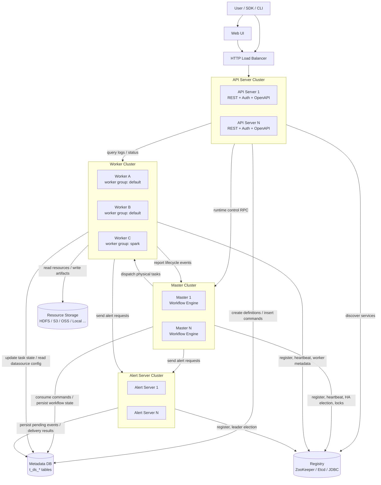
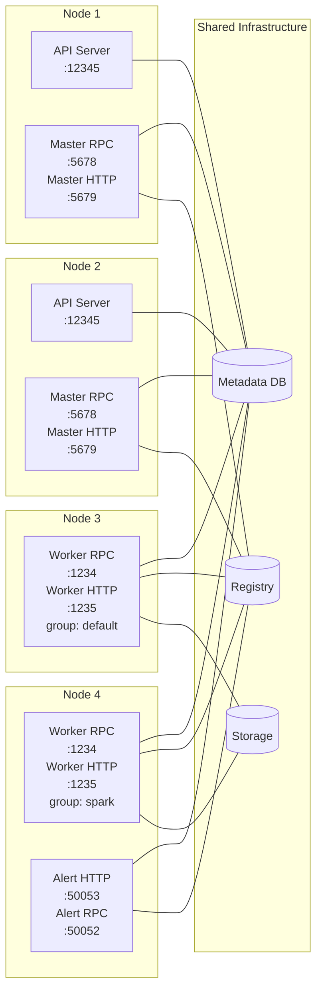
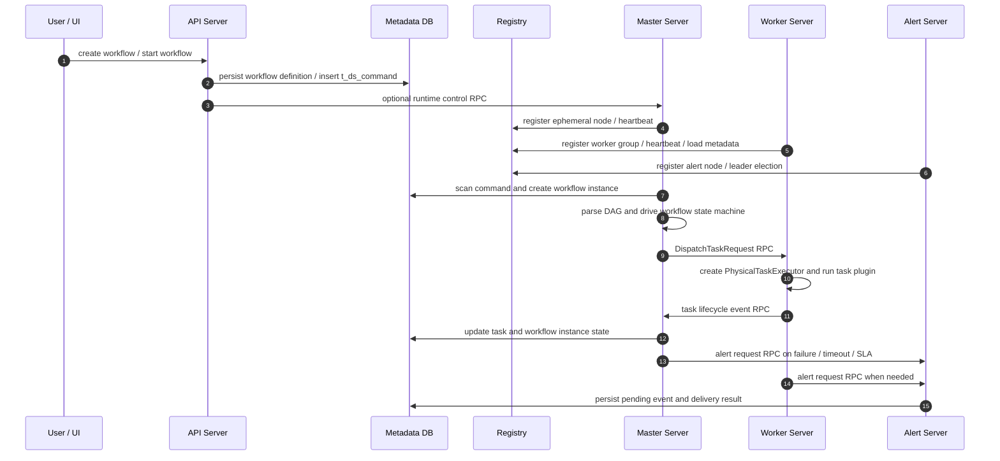
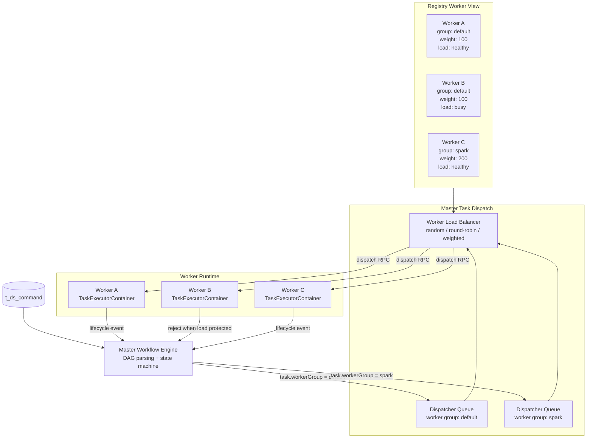
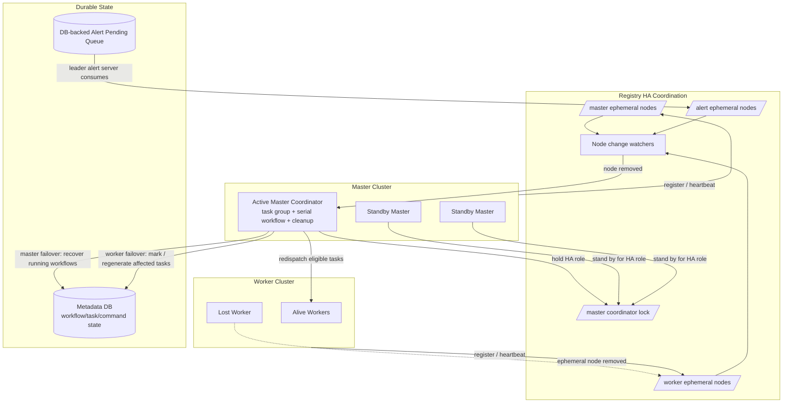
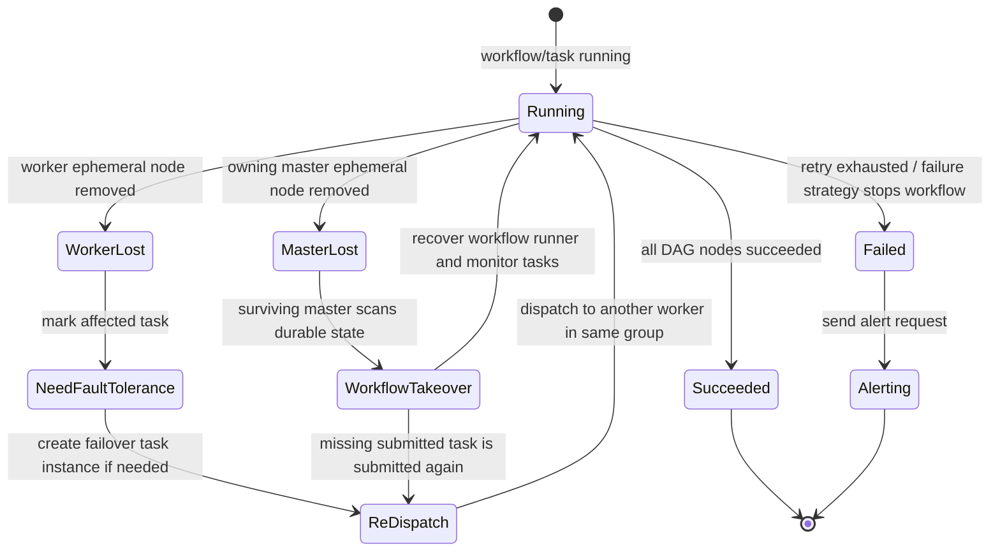

# DolphinScheduler 项目架构文档

本文从部署视角说明 DolphinScheduler 的核心组件、进程间通信、Master 与 Worker 的任务分配，以及集群高可用机制。它面向本仓库开发、部署和排障使用；更细的模块约束请继续参考各模块目录下的 `CLAUDE.md`。

## 1. 总体部署架构

DolphinScheduler 是一个多进程、可水平扩展的分布式调度系统。生产环境通常至少包含 API、Master、Worker、Alert 四类服务进程，以及外部的元数据库、注册中心和资源存储。

核心部署要点：

- **API Server** 是无状态入口，负责 UI、外部客户端、Python SDK 等请求的认证、参数处理和业务服务调用。
- **Master Server** 负责命令消费、工作流 DAG 解析、流程状态机、任务切分、任务调度和故障接管。
- **Worker Server** 负责接收 Master 派发的物理任务，加载对应 task plugin 执行，并把生命周期事件回传给 Master。
- **Alert Server** 负责告警事件的持久化、消费和插件化通知发送。
- **Metadata DB** 是流程定义、流程实例、任务实例、命令队列、告警记录等核心状态的持久化存储。
- **Registry** 提供服务发现、临时节点、心跳、分布式锁和 HA 选举能力。默认使用 ZooKeeper，也支持 Etcd / JDBC。
- **Storage** 保存资源中心文件和分布式任务运行所需的资源、产物或日志相关文件。

## 2. 组件部署架构

每类组件都可以独立扩缩容。API 通过负载均衡接入；Master、Worker、Alert 通过 registry 发现彼此并维持集群元数据。

默认端口以各服务 `application.yaml` 为准：

| 组件 | 默认端口 | 作用 |
| --- | --- | --- |
| API Server | `12345` | UI / REST / OpenAPI 入口 |
| Master RPC | `5678` | API 控制 Master、Worker 回调 Master、Master 间运行时通信 |
| Master HTTP | `5679` | Master 管理和健康相关 HTTP 端口 |
| Worker RPC | `1234` | Master 派发任务、查询任务、获取日志 |
| Worker HTTP | `1235` | Worker 管理和健康相关 HTTP 端口 |
| Alert HTTP | `50053` | Alert 服务 HTTP 端口 |
| Alert RPC | `50052` | Master / Worker 发送告警请求 |
| Registry | `2181` | ZooKeeper 默认端口 |

## 3. 进程间通信机制

DolphinScheduler 的通信由三类通道共同完成：数据库持久化状态、RPC 运行时交互、注册中心协调。

通信分工：

- **API -> DB**：流程定义、项目、资源、用户、数据源、命令等元数据写入。
- **API -> Master RPC**：启动、暂停、停止、恢复等运行时控制会触达 Master。
- **Master -> DB**：消费 `t_ds_command`，创建和更新 `t_ds_workflow_instance`、`t_ds_task_instance` 等运行状态。
- **Master -> Worker RPC**：派发任务、取消任务、查询任务运行状态。
- **Worker -> Master RPC**：上报任务提交、运行、成功、失败、重试等生命周期事件。
- **Master / Worker -> Alert RPC**：把失败、超时、SLA 等事件发送给 Alert Server。
- **服务 -> Registry**：注册临时节点、发布心跳和负载元数据、监听节点变化、参与分布式锁和 HA 选举。
- **Worker -> Storage**：读取资源中心文件，写入或使用任务运行相关资源。

## 4. Master 与 Worker 的任务分配

Master 不直接把所有任务随机丢给任意 Worker，而是先按任务配置的 **worker group** 进入对应的调度队列，再在该 group 下选择可用 Worker。Worker 自身会向 registry 上报 group、地址、权重、负载和健康状态。

分配逻辑可以按以下步骤理解：

1. 用户手动触发或 Quartz 定时触发后，系统向 `t_ds_command` 写入命令。
2. Master 消费命令，创建工作流实例，解析 DAG，并为可运行节点创建任务实例。
3. 每个任务实例带有 `workerGroup`。Master 为每个 worker group 维护独立的 dispatcher 和优先级/延迟队列。
4. Dispatcher 根据 registry 中的 Worker 元数据选择同组 Worker。当前代码支持随机、轮询、固定权重轮询、动态权重轮询等负载均衡策略。
5. Master 通过 RPC 向目标 Worker 发送 `DispatchTaskRequest`。
6. Worker 的 `PhysicalTaskExecutorFactory` 创建物理任务执行器，加载 Shell、SQL、Spark、Flink、Python 等具体 task plugin。
7. Worker 执行过程中把生命周期事件回传 Master；Master 再推进任务和工作流状态机。
8. 如果 Worker 负载保护触发，Worker 会拒绝新的任务派发，Master 可重新选择其他可用 Worker。

## 5. HA 与故障转移机制

高可用依赖三层机制：服务多副本、registry 临时节点与监听、数据库持久化运行状态。进程可以横向扩展，单个进程故障不会让整个集群丢失已持久化的调度状态。

HA 关键点：

- **Master HA**：多个 Master 同时运行并注册到 registry。`MasterCoordinator` 基于 registry 选出 active 协调者，负责 task group、串行工作流协调和历史 failover 标记清理；其他 Master 处于 standby。当 active 节点失联或退出后，registry 触发重新选举。
- **Master 故障转移**：Master 注册的是临时节点。节点消失后，存活 Master 根据持久化的工作流与任务状态接管运行中实例，恢复或重新提交需要处理的任务。
- **Worker HA**：Worker 也注册临时节点并周期性上报心跳、worker group 和负载信息。Master 监听 Worker 节点变化；Worker 消失后，相关任务会进入容错处理，必要时生成 failover task instance 并重新派发到同 worker group 的其他 Worker。
- **Alert HA**：Alert Server 多副本部署，pending alert 事件保存在 DB 中。只有 leader 消费队列并发送通知，其他副本 standby；leader 故障后由其他 Alert Server 接管。
- **数据库持久化**：命令、定义、实例、任务状态和告警事件都落在 Metadata DB 中。即使 Master / Worker 进程重启，也能通过 DB 状态恢复调度上下文。
- **断连自停**：Master / Worker 与 registry 长时间断开时会主动停止自身，避免孤立节点继续执行导致重复调度或状态分裂。

## 6. 故障场景下的状态流转

## 7. 运维与排障观察点

| 关注点 | 观察位置 | 典型问题 |
| --- | --- | --- |
| 命令是否产生 | `t_ds_command` | 点击启动后 Master 没有消费 |
| 工作流实例状态 | `t_ds_workflow_instance` | 流程卡在运行中、暂停中、失败恢复中 |
| 任务实例状态 | `t_ds_task_instance` | 任务等待派发、运行、失败、需要容错 |
| Master 注册与心跳 | Registry master 节点 | Master 不参与调度或频繁下线 |
| Worker group 元数据 | Registry worker 节点 | 找不到 worker group、任务无法派发 |
| Worker 负载保护 | Worker 日志和指标 | CPU / memory / task count 超阈值后拒绝派发 |
| RPC 连通性 | Master / Worker / Alert 日志 | 派发失败、生命周期事件回传失败、告警发送失败 |
| Alert pending queue | DB 告警相关表 | 告警积压或 leader 未消费 |

## 8. 建议校验方式

文档变更不涉及代码编译。建议用以下方式校验：

1. 在支持 Mermaid 的 Markdown 预览器中打开本文，确认所有图可以渲染。
2. 对照各服务 `application.yaml` 检查端口和 registry 配置是否仍一致。
3. 本地启动 Postgres / ZooKeeper / Master / Worker / API 后，触发一个 Shell 或 SQL 工作流，观察命令入库、Master 派发、Worker 执行、事件回传这条链路是否与文档一致。
4. 在测试环境停止一个 Worker，确认任务进入容错或重新派发；停止 active Master，确认存活 Master 接管运行状态。

